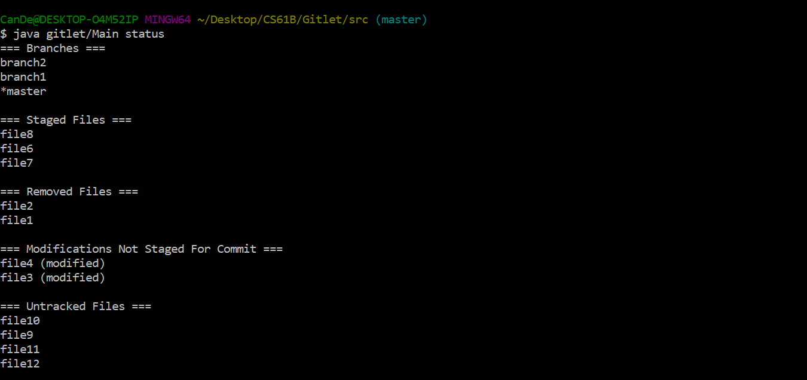

# Gitlet
Gitlet is a version control system inspired by the popular system **Git**. It is a course project of CS61B: Data Structures (Spring 2020) at UC Berkeley.

Gitlet mimics some features of Git. It supports operations such as **add, commit, status, log, checkout, reset, branch, merge**. Some remote features are also implemented such as **add-remote, pull, fetch, push** and **clone**.



## How to Use
Clone this repository to your local machine:
```
git clone https://github.com/Wolverine-Can/Gitlet.git
```
In the repository directory, run the below commands to initiate Gitlet:
```
javac gitlet/Main.java
java gitlet/Main.java init
```
Start using gitlet by running commands like this:
```
java gitlet/Main [command]
```
Most commands usage are similar to their usage in **Git**. For detailed instructions, please check out [Gitlet Project Details](https://inst.eecs.berkeley.edu/~cs61b/sp20/materials/proj/proj3/)

## Command List:
- init
- add
- commit
- rm
- log
- global-log
- find
- status
- checkout
- branch
- rm-branch
- reset
- merge
- add-remote
- rm-remote
- push
- fetch
- pull
- clone
